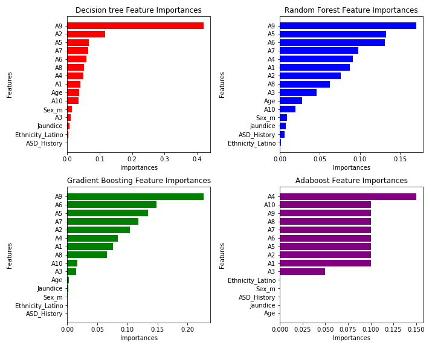
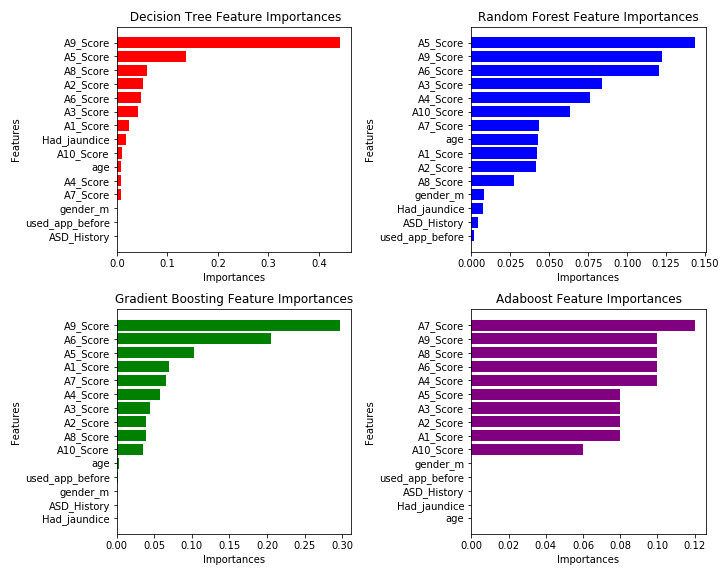

# Can ASD be predicted given some behavioral and individual features?
## Introduction  
There are over 100,000 children in the UK that have been diagnosed with Autism Spectrum Disorder (ASD). Children on the ASD spectrum tend to show social interaction difficulties as well as speech and language problem.  Parents of children on ASD spectrum is faced with the challenge of dealing with the beahiour and also providing adequate support for the children to help them improve in the aspect of child development impacted by ASD.  
 
Children with potential ASD shows some behavioral signs including avoiding eye contact, delayed speech, non-flexibility (getting really upset with change of routine), being obsessed with one toy, having trouble understanding other people’s feelings, struggling with jokes or sarcasm, repetitive behavior. This is not an exhaustive list of the signs of ASD in toddlers.
ASD diagnosis commences with parents of the child completing a Modified Checklist for Autism in Toddlers (M-CHAT). It is an early test for children between 16-30 months. However, this is not a proper diagnosis but could points to whether the child could develop ASD or not. Early detection of ASD is crucial as early intervention significantly improves the child’s condition. Children with ASD could get help from developmental pediatrician, occupational therapist, speech therapist and educational psychologist. It should be noted that confirmatory ASD diagnosis is usually delayed till a child is about 4-5 years. However, early prediction of the possibility of a child having ASD will significantly improve the child’s behavior, as appropriate support will be provided early.  
### Data Collection
The data for this project was obtained from kaggle website. There are two sets of data – Toddler autism data and Adult autism data  
**Adult data:**  
Number of records: 704  
Number of features: 20  
Features:  
* A1_Score – A10_Score – set of behavioural questions asked   
* Age – Age of the participant in years  
* Gender – Male or female  
* Ethnicity – The ethnic group the participant belongs  
* Had_jaundice – Whether the participant had jaundice at birth or not  
* Family_History – Whether the participant has family history of autism  
* Country of residence – Country where participant resides  
* Used_app_before – Whether the participant has used the app before  
* Result – The overall result of the test based on A1_Score – A10_Score  
* Age_desc – Age description of participant ( e.g 18 years and above)  
* Relation – Relationship of the test taker with the person answering the questionnaire  
* Class – Target class (whether the participant has autism or not)  
   

**Toddler data:**   
Number of records: 1054    
Number of features: 18   
Features:  
* A1 – A10 - Set of behavioural questions asked   
* Age – The child’s age in Months   
* Sex – Male or female  
* Ethnicity – The ethnic group the participant belongs  
* Had_jaundice – Whether the child developed jaundice at birth or not  
* Family_History – Whether the child has a family member with autism  
* Qchat-10-Score - The overall result of the test based on A1 – A10 scores  
* Test_taker_relation - Relationship of the test taker with the person answering the questionnaire  
* Class – Target class  
 

### Preprocessing
**Data Cleaning**  
The toddler dataset has no missing values and duplicate. On the other hand, ethnicity and test_taker_relation columns contain about 13% missing values and were filled with the word ‘missing’. The age column of the adult data sets contains two rows with missing values and the two rows were dropped.   
Column transformation: The yes/no categorical features were transformed to 1/0 including the target variable
 

**Exploratory data analysis (EDA)**    
The distribution of the features and the target were explored as well as the relationship between features and target variable. The following were observed:  
 

**Toddler dataset**  
* Toddlers of 36 months of age participated the most   
* Toddlers with ASD answered mostly ‘yes’ to the A1- A10 behavioural question. This suggest a strong association between ASD and the A1-A10 features   
* There is no strong association between age and autism  
* There are more male participants  
* Most participants are White European and Asian  
* Most participant did not develop jaundice at birth  
* Most participant do not have family history of autism  
* The majority class is the ‘Yes’ class    
 

**Adult dataset:**  
* More younger people (20-30 years) participated than older ones (31 -64 years)  
* Adults with ASD answered mostly ‘yes’ to the A1- A10 behavioural question. This suggest a strong association between ASD and the A1-A10 features  
* There is approximately equal distribution of the male and female categories in the sex column  
* White European participated the most  
* More people had Jaundice when they were born  
* People that participated are mostly from the US,UAE, New Zealand and UK  
* Most people that participated have not used the app before  
* Most people participated in person  
* The majority class is the ‘No’ class  
### Modeling  
The result and the Qchat-10-Score columns were dropped as they were obtained from the A1-A10 columns. This is necessary to prevent overfitting.  
One-hot-encoding was used to transform the non-binary categorical features to numerical for modeling.   
80% - 20% train-test split was used.  
The results of the models used are summarized below:  
**Toddler**  
Baseline accuracy: 69%  
Model | Best model accuracy CV (train) | Best model accuracy CV (test)
------| -------------------------------| -----------------------------
Decision tree |    91.3  |  88.1
Random forest |  96.2  |  95.2
Gradient boosting | 98.7  | 96.2
Adaboost | 100  | 99.3

Model | Precision | Recall | f1 score
------| ----------| -------| ---------
Decision tree | 93.0   | 94.7  |  93.8
Random forest |  97.6  |  96.9  |  96.2
Gradient boosting |  98.8  | 99.3 | 99.1
Adaboost |  99.3  |  99.3  |  99.3  

**Adult**  
Baseline accuracy: 69%  
Model | Best model accuracy CV (train) | Best model accuracy CV (test)
------| -------------------------------| -----------------------------
Decision tree |    91.1  |  88
Random forest |  96.3  |  93.0
Gradient boosting | 98.7  | 96.2
Adaboost | 99  | 96

Model | Precision | Recall | f1 score
------| ----------| -------| ---------
Decision tree | 80.5   | 84.9  |  82
Random forest |  95.4  |  89  |  92
Gradient boosting |  93  | 80 | 86
Adaboost |  94.8  |  94.0  |  94.4  

### Feature Importances
Plot of feature importances presented below shows that:
* A9 is the strongest predictor for all models examined except for Adaboost with A4 being the strongest predictor
* For other models except Adaboost, there is variation in feature importance for the A predictors.
* For Adaboost, only the A predictors are important and they have almost equal importance except A3 and A4.  
In general, responses to questions A1-A10 mostly determine whether a child will develop autism or not.   

   

  

  <i> Feature importances for toddler dataset </i>

  

  

  <i> Feature importances for Adult dataset </i>

### Conclusion  
Autism dataset consisting of 1054 rows and 18 features (Toddler) and 704 row and 20 features (Adults) were explored and a model that predicts whether a toddler/adult will be diagonised with autism disorder was built from features comprising of set of behavioural questions about the participants (A1-A10) and some personal information. Correlation plot of the features with the target revealed that A1-A10 features more strongly correlated with the features and could be better predictors.  
Different models were tested including Naive Bayes, Decision tree, Random forest, Gradient boosting and Adaboost. A model which predicts the majority class was chosen as the basline model. The f1 score was chosen as a metric to measure the performance of the models and it was found that Adaboost has the the highest f1 score and was chosen as the best model for both toddler and adult datasets. An improvement of 31% on the baseline model was observed. Plots of feature importances show that A9 in general has the strongest predictive power except in the case of Adaboost which has A4 as the strongest predictor. Adaboost was the best model for both toddler and adult datasets.

